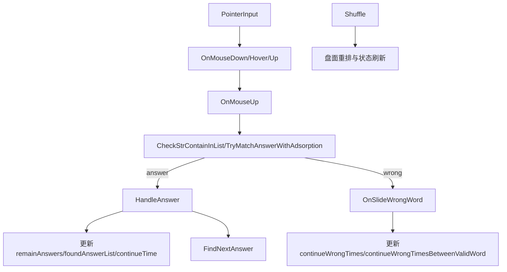

# 夸夸重构：GameController 入口与能力缺口计划

## 目标范围

- 以文档《4.0.8 夸夸重构》为准，分析当前玩法判定链路能否支撑 5 类夸夸触发与门控规则。
- 聚焦玩法控制层入口、状态更新、判定方法完备性，不在本阶段改代码。

## 代码入口点位（当前已存在）

- 关卡与状态初始化入口：`[D:/Git/WordCrushEn/Assets/Scripts/Game/Controller/GameController.cs](D:/Git/WordCrushEn/Assets/Scripts/Game/Controller/GameController.cs)` 的 `Init(...)`。
- 输入入口（按下/拖动/抬起）：`[D:/Git/WordCrushEn/Assets/Scripts/Game/Controller/GameController.ClickArea.cs](D:/Git/WordCrushEn/Assets/Scripts/Game/Controller/GameController.ClickArea.cs)` 的 `OnPointerDown/OnDrag/OnPointerUp`，落到 `OnMouseDown/OnMouseHover/OnMouseUp`。
- 划词总判定入口：`[D:/Git/WordCrushEn/Assets/Scripts/Game/Controller/GameController.cs](D:/Git/WordCrushEn/Assets/Scripts/Game/Controller/GameController.cs)` 的 `OnMouseUp()`。
- 答案成功处理入口：同文件 `HandleAnswer(...)`。
- 错词处理入口：同文件 `OnSlideWrongWord()`。
- 洗牌入口（影响类型1预告锁定）：同文件 `Shuffle(...)`。
- 道具前置判定入口：`[D:/Git/WordCrushEn/Assets/Scripts/Game/Controller/GameController.PropUse.cs](D:/Git/WordCrushEn/Assets/Scripts/Game/Controller/GameController.PropUse.cs)` 的 `PreCheckPropUse(...)`。

## 当前主流程映射（与夸夸触发相关）

## 已具备的关键判断能力

- `答案词判定`：`CheckStrContainInList(...)` 已支持正向/逆向匹配（受 `ReverseSwipeEnabled` 控制）。
- `弱纠错吸附`：`TryMatchAnswerWithAdsorption(...)` 已支持少划/多划一字母吸附，且仅对长词生效。
- `错词统计`：`OnSlideWrongWord()`、`continueWrongTimes`、`continueWrongTimesBetweenValidWord` 已具备。
- `答案间隔时间统计基础`：`findAnswerBeginTime/findAnswerUsedTim` 在 `HandleAnswer(...)` 中更新，可用于“距上次答案时间”。
- `自由解数量基础`：`FindAllAnswer()/FindAllAnswerNew()/FindAllAnswerNew_1()` 可获取当前可划答案集合。
- `逆序答案识别基础`：`isReverse` 在 `OnMouseUp()` 已有方向判定。
- `仅答案词链路`：夸夸判定可挂在 `HandleAnswer(...)` 之后，天然避开 Bonus 词与错词路径。

## 不具备/缺失的判断方法与功能说明

- `总门控判断缺失`：缺统一方法检查 `FunctionConfig id=53 + PraiseTypeConfig.Switch + isUserControl + DiffTag>0`。
  - 需新增如 `CanShowPraiseByGlobalGate(typeId)`。
- `PraiseTypeConfig 读取与解析缺失`：无集中解析 `Param/Priority/FirstCD/CD/MaxTimes/TextPool` 的服务。
  - 需新增配置访问与字符串解析器（支持 `-1` 语义、逗号/中文逗号兼容）。
- `FirstCD/CD 引擎缺失`：无“按类型维度”记录上次展示时刻与答案计数快照。
  - 需新增每类型运行时状态 `lastShowAnswerCount/lastShowTime/showTimes`。
- `类型候选统一评估缺失`：当前无 `EvaluatePraiseCandidates()` 做 1~4 互斥择优 + 5 独立判定。
- `类型1预告锁定机制缺失`：无“预告后锁定本步答案、Shuffle解除锁定”的状态机。
  - 需新增 `challengeLock`（锁定步次/答案）及在 `Shuffle(...)` 里清理。
- `类型2阈值判断缺失`：虽有错词计数，但无“相对上次答案后 >N 错词才触发”的独立判断函数。
  - 需新增 `IsPraiseType2Satisfied(...)`。
- `类型3时间阈值判断缺失`：无独立“相对上次答案时间 >N 秒”判断函数。
  - 需新增 `IsPraiseType3Satisfied(...)`。
- `类型4连划答案判断缺失`：虽有 `continueWrongTimes`，但无“本次答案与上次答案间无错词”的显式封装。
  - 需新增 `IsPraiseType4Satisfied(...)`。
- `类型5独立触发判断缺失`：无“剩余答案>5 且自由解>1 且本次为逆序答案”的独立函数。
  - 需新增 `IsPraiseType5Satisfied(...)`。
- `展示分发层缺失`：当前无统一 `DispatchPraiseUI(type, context)`，难以接入 UI1/UI2/横幅/上漂拇指。
- `文档矛盾防护缺失`：类型1短词阈值 `<4/<5`、类型3正文冲突、类型5资源描述冲突未在实现策略中固化。

## 拟定实现计划（后续执行顺序）

- 在 `[D:/Git/WordCrushEn/Assets/Scripts/Game/Controller/GameController.cs](D:/Git/WordCrushEn/Assets/Scripts/Game/Controller/GameController.cs)` 增加“夸夸运行时状态结构”和流程挂点：
  - `OnMouseDown` 前置检查类型1预告。
  - `HandleAnswer` 后置做候选评估与展示分发。
  - `OnSlideWrongWord` 更新错词统计快照。
  - `Shuffle` 清理类型1锁定状态。
- 新增 `PraiseEvaluator`（可放 `Scripts/Game/Controller` 或 `Scripts/Game/Manager`）实现：
  - 全局门控、类型条件、FirstCD/CD/MaxTimes、优先级裁决（1~4 互斥，5 独立）。
- 新增 `PraiseConfigAdapter` 对接 `PraiseTypeConfig`：
  - 解析 `Param`、`FirstCD/CD`，统一数值规则。
- 新增 UI 分发接口（由 `GameController -> UiGameMenu`）：
  - Type1 预告/夸奖双态、Type2/3 横幅、Type4 Combo口播替换、Type5 上漂拇指。
- 补充埋点与回归校验：
  - 验证仅答案词触发、Bonus不触发、各类型 MaxTimes 生效、CD/FirstCD 生效、Shuffle 解锁类型1。

## 关键依赖文件

- `[D:/Git/WordCrushEn/Assets/Scripts/Game/Controller/GameController.cs](D:/Git/WordCrushEn/Assets/Scripts/Game/Controller/GameController.cs)`
- `[D:/Git/WordCrushEn/Assets/Scripts/Game/Controller/GameController.ClickArea.cs](D:/Git/WordCrushEn/Assets/Scripts/Game/Controller/GameController.ClickArea.cs)`
- `[D:/Git/WordCrushEn/Assets/Scripts/Game/Controller/GameController.PropUse.cs](D:/Git/WordCrushEn/Assets/Scripts/Game/Controller/GameController.PropUse.cs)`
- `[D:/Git/WordCrushEn/Assets/Scripts/UI/Game/UiGameMenu.cs](D:/Git/WordCrushEn/Assets/Scripts/UI/Game/UiGameMenu.cs)`
- `[D:/softwares/crush_doc/4.0.8 夸夸重构.md](D:/softwares/crush_doc/4.0.8%20夸夸重构.md)`

## 需先确认的实现基线

- 类型1短词阈值按 `<4` 执行。
- 类型3按“时间间隔 >45s”执行，忽略正文误复制。
- 类型5资源先按“上漂拇指”执行，若美术资源未到位先降级占位。

